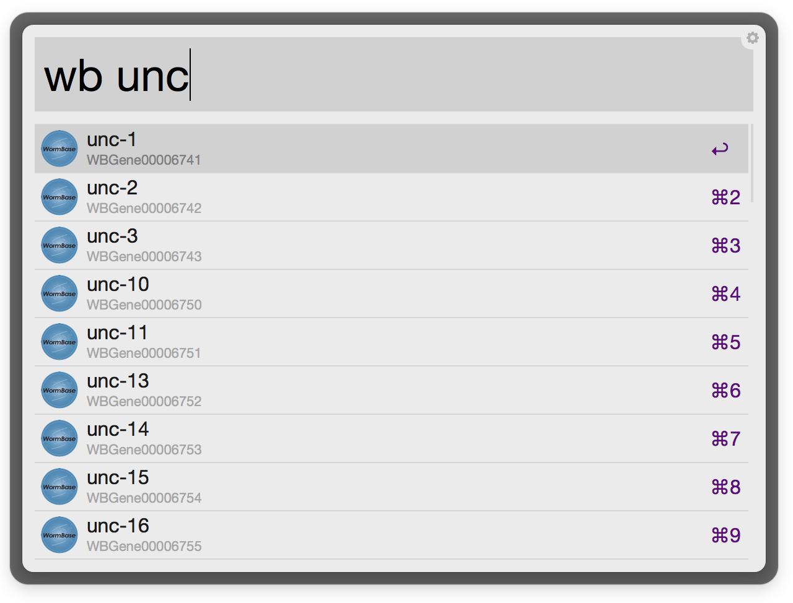
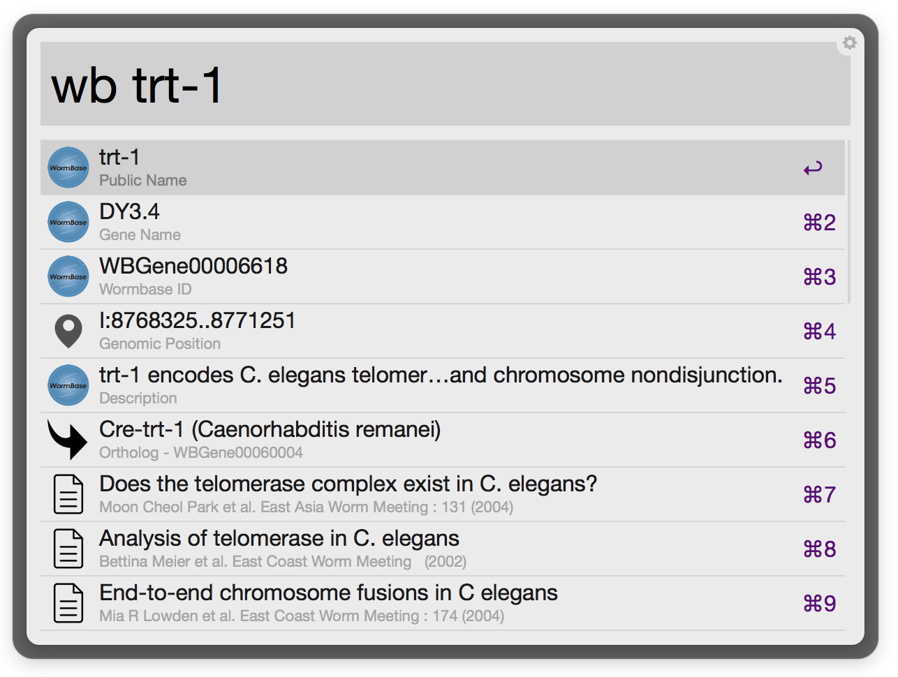

# wormbase-alfred

An alfred extension for wormbase!

### [Download the latest release](https://github.com/danielecook/wormbase-alfred/releases/latest)

## Usage

__Search for genes on wormbase__

__Get information on a specific gene__

